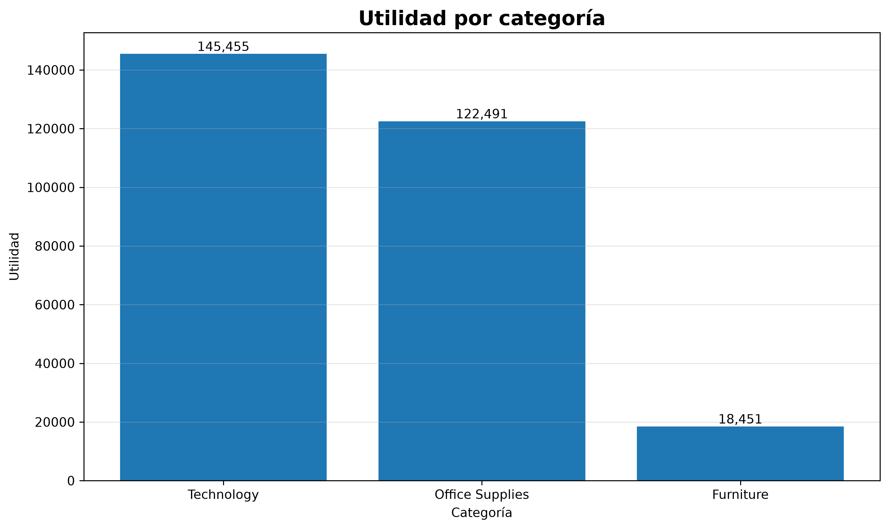
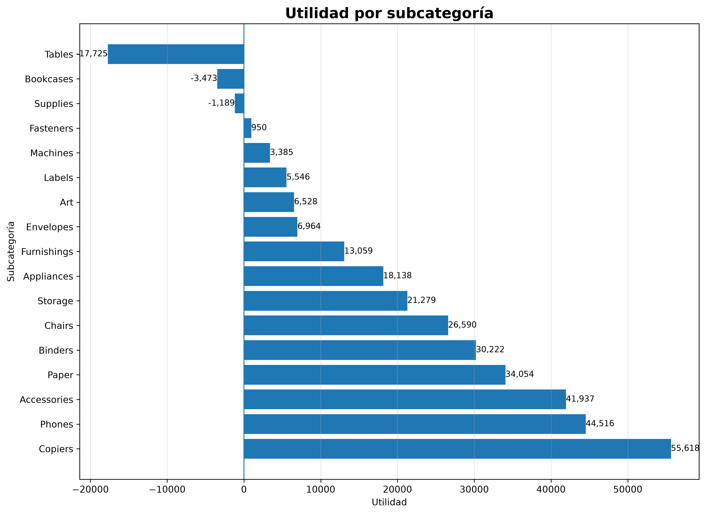
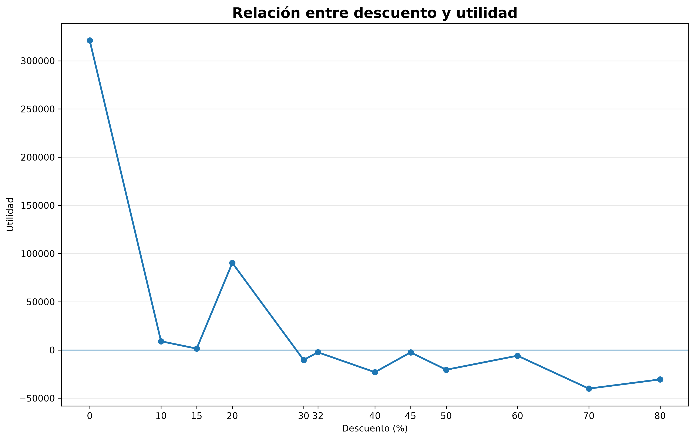
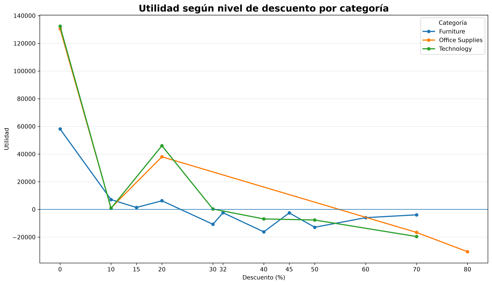
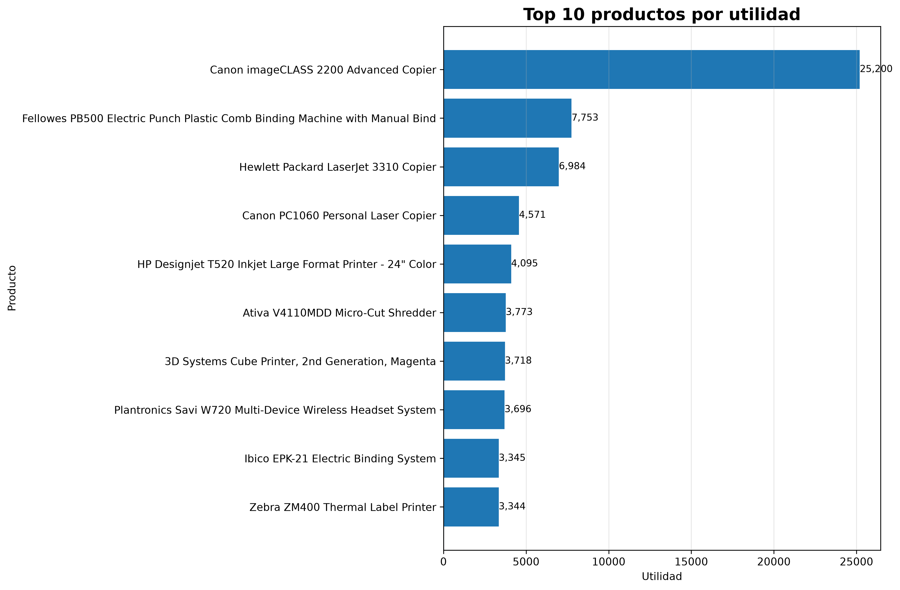
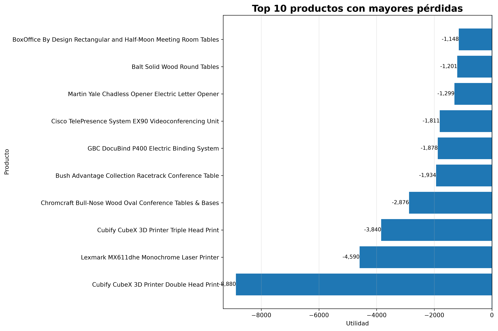
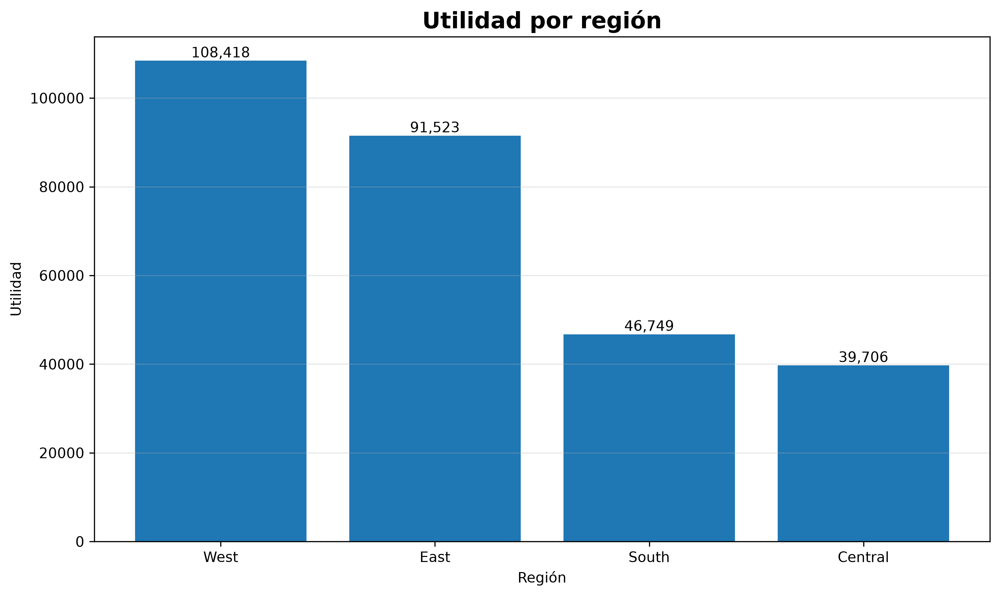
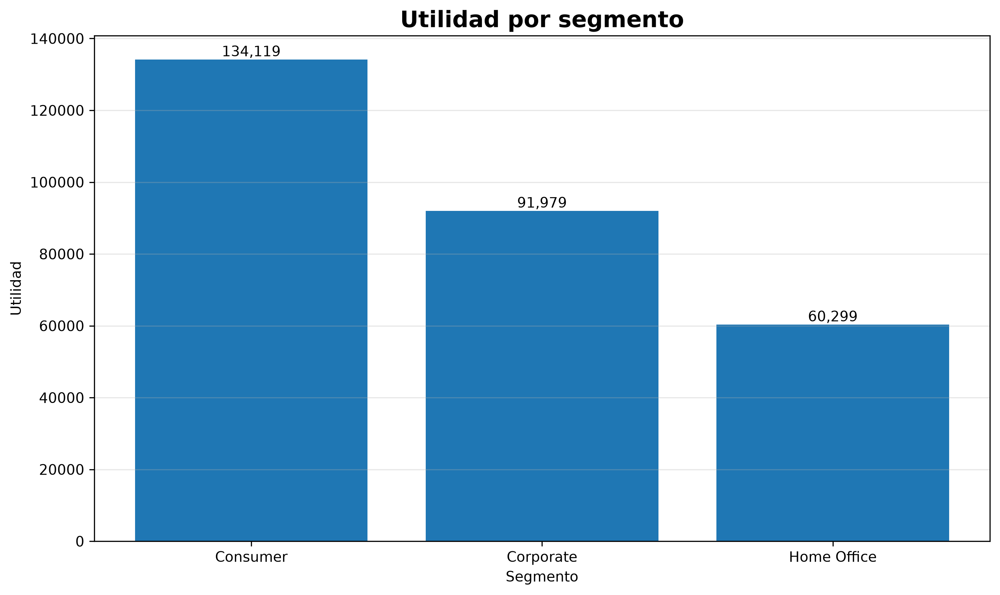
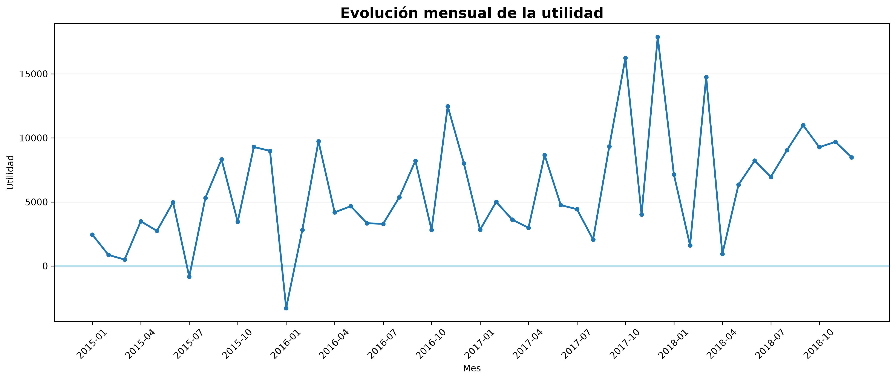

# Proyecto de Análisis de Rentabilidad

## De datos comerciales a insights para la toma de decisiones

Proyecto de **Data Analytics + Financial Analytics** enfocado en analizar el desempeño comercial y la rentabilidad de una empresa a partir de información de ventas, productos, descuentos, categorías, regiones y segmentos de clientes.

El análisis integra **Python, SQL y Power BI** para transformar datos transaccionales en indicadores, visualizaciones y hallazgos orientados al negocio.

---

## Objetivo del proyecto

Analizar los principales factores asociados al desempeño comercial y la rentabilidad para identificar:

* Evolución de ventas y utilidad.
* Categorías y subcategorías con mayor contribución.
* Productos rentables y productos con pérdidas.
* Comportamiento de la rentabilidad frente a los descuentos.
* Diferencias de rentabilidad entre regiones y segmentos.
* Operaciones individuales con pérdidas significativas.
* Áreas que requieren seguimiento desde una perspectiva comercial y financiera.

---

## Preguntas de negocio

El análisis busca responder preguntas como:

* ¿Cuál es el nivel general de ventas y rentabilidad?
* ¿Cómo evoluciona la utilidad a través del tiempo?
* ¿Qué categorías y subcategorías generan mayor utilidad?
* ¿Qué productos presentan pérdidas acumuladas?
* ¿Qué relación observada existe entre descuentos y margen?
* ¿Qué regiones y segmentos presentan diferentes niveles de rentabilidad?
* ¿Dónde se concentran las operaciones con pérdidas?

---

## Dataset

El proyecto utiliza un dataset transaccional de ventas con información sobre:

* Pedidos y fechas.
* Clientes.
* Categorías y subcategorías.
* Productos.
* Ventas.
* Cantidades.
* Descuentos.
* Utilidad.
* Regiones y segmentos.

Durante la preparación se identificaron registros incompletos y se generó una versión limpia para el análisis SQL.

### Datos analizados

| Indicador            |     Resultado |
| -------------------- | ------------: |
| Registros analizados |         9,994 |
| Órdenes              |         5,009 |
| Clientes             |           793 |
| Productos            |         1,894 |
| Unidades vendidas    |        37,873 |
| Ventas totales       | $2,297,200.86 |
| Utilidad total       |   $286,397.02 |
| Margen de utilidad   |        12.47% |

---

## Metodología

El proyecto se desarrolló en cuatro etapas principales:

### 1. Preparación y análisis exploratorio — Python

Se realizó:

* Limpieza y validación de datos.
* Conversión y tratamiento de fechas.
* Análisis exploratorio.
* Agregaciones por periodo, categoría, subcategoría, producto, región y segmento.
* Cálculo de utilidad y margen.
* Identificación de productos y operaciones con pérdidas.
* Generación de visualizaciones.

Herramientas principales:

**Python · Pandas · NumPy · Matplotlib**

---

### 2. Análisis SQL

Los datos limpios fueron almacenados en una base de datos SQLite para realizar consultas orientadas a preguntas de negocio.

El archivo [`analysis.sql`](sql/analysis.sql) contiene consultas para:

* KPIs generales.
* Rentabilidad por categoría.
* Rentabilidad por subcategoría.
* Rentabilidad según nivel de descuento.
* Rentabilidad por región.
* Rentabilidad por segmento.
* Productos con pérdida neta.
* Operaciones individuales con pérdida.
* Clasificación de productos por rentabilidad.

---

### 3. Visualización — Power BI

Se desarrolló un dashboard para facilitar el análisis interactivo mediante indicadores, gráficos y filtros.

El reporte permite analizar diferentes dimensiones del negocio y explorar la rentabilidad desde una perspectiva ejecutiva y operativa.

[**Abrir archivo Power BI**](powerbi/Proyecto_rentabilidad_Proyecto_1.pbix)

> Para abrir el archivo `.pbix` se requiere Power BI Desktop.

---

### 4. Análisis ejecutivo

Los resultados fueron interpretados desde una perspectiva de negocio, diferenciando:

**Resultados → Hallazgos → Riesgos/Oportunidades → Líneas de análisis**

---

# Principales resultados

## Rentabilidad por categoría

Las tres categorías presentan diferencias importantes en su contribución a la utilidad:

| Categoría       |      Ventas |    Utilidad | Margen |
| --------------- | ----------: | ----------: | -----: |
| Technology      | $836,154.03 | $145,454.95 | 17.40% |
| Office Supplies | $719,047.03 | $122,490.80 | 17.04% |
| Furniture       | $741,999.80 |  $18,451.27 |  2.49% |

El resultado muestra una diferencia significativa en el margen observado entre categorías, especialmente en **Furniture**, cuyo margen es considerablemente menor que el de Technology y Office Supplies.



---

## Rentabilidad por subcategoría

El análisis muestra diferencias importantes entre subcategorías.

Entre las subcategorías con mayor utilidad acumulada se encuentran:

* Copiers.
* Phones.
* Accessories.
* Paper.
* Binders.

También se identificaron subcategorías con utilidad negativa acumulada, entre ellas:

* Tables.
* Bookcases.
* Supplies.



---

## Descuentos y rentabilidad

Se observó una asociación entre niveles elevados de descuento y menores márgenes de utilidad.

Los niveles de descuento más altos presentan márgenes negativos en varias observaciones agregadas.



### Importante

Este análisis muestra una **asociación observada**, no demuestra por sí mismo una relación causal entre descuento y pérdida.

Por ello, los resultados deben interpretarse junto con variables como producto, categoría, volumen, región y características de la operación.

---

## Descuentos por categoría

El análisis segmentado permite observar que el comportamiento de los descuentos no es homogéneo entre categorías.



Esta perspectiva permite identificar combinaciones de **categoría + descuento** que requieren un análisis comercial más detallado.

---

# Productos rentables y productos con pérdidas

La clasificación de productos, agrupando por **Product ID + Product Name**, produjo:

| Clasificación              | Productos |
| -------------------------- | --------: |
| Productos rentables        |     1,584 |
| Productos con pérdida      |       304 |
| Sin utilidad significativa |         6 |
| **Total**                  | **1,894** |

Los productos clasificados como pérdida acumulan aproximadamente **-$77,092.02** de utilidad.





---

# Operaciones con pérdidas

A nivel transaccional se identificaron:

* **1,871 operaciones con pérdida**
* **$468,707.15 en ventas asociadas**
* **-$156,131.29 de pérdida acumulada**
* **7,040 unidades involucradas**

La distribución de las pérdidas muestra una concentración importante en determinadas categorías y subcategorías.

Entre las subcategorías con mayores pérdidas acumuladas aparecen:

* Binders.
* Tables.
* Machines.
* Bookcases.
* Chairs.

Este análisis permite pasar de una visión agregada del negocio a la identificación de operaciones específicas que pueden ser revisadas.

---

# Rentabilidad por región

| Región  |      Ventas |    Utilidad | Margen |
| ------- | ----------: | ----------: | -----: |
| West    | $725,457.82 | $108,418.45 | 14.94% |
| East    | $678,781.24 |  $91,522.78 | 13.48% |
| South   | $391,721.91 |  $46,749.43 | 11.93% |
| Central | $501,239.89 |  $39,706.36 |  7.92% |



La comparación permite identificar diferencias de desempeño entre regiones y establecer puntos de partida para investigaciones comerciales posteriores.

---

# Rentabilidad por segmento

| Segmento    |        Ventas |    Utilidad | Margen |
| ----------- | ------------: | ----------: | -----: |
| Consumer    | $1,161,401.00 | $134,119.21 | 11.55% |
| Corporate   |   $706,146.40 |  $91,979.13 | 13.03% |
| Home Office |   $429,653.10 |  $60,298.68 | 14.03% |



---

# Evolución mensual

El análisis temporal permitió estudiar la evolución mensual de ventas y utilidad durante el periodo analizado.

El mes con mayor utilidad fue **diciembre de 2017**, mientras que el menor resultado mensual correspondió a **enero de 2016**.



---

# Hallazgos principales

### 1. Diferencias importantes de rentabilidad entre categorías

Technology y Office Supplies presentan márgenes cercanos al 17%, mientras que Furniture presenta un margen considerablemente menor.

### 2. Los descuentos altos están asociados con márgenes negativos en varias observaciones

El patrón observado justifica revisar las políticas comerciales de descuento por producto y categoría.

### 3. Las pérdidas están concentradas en determinados productos y subcategorías

La clasificación de productos permite identificar 304 productos con utilidad acumulada negativa.

### 4. Existen diferencias regionales

Las regiones presentan niveles distintos de margen, lo que permite identificar áreas para análisis comercial adicional.

### 5. La rentabilidad varía entre segmentos

Los segmentos presentan diferentes niveles de margen, por lo que el análisis de clientes puede complementarse con producto, descuento y región.

---

# Riesgos y oportunidades identificados

## Riesgos

* Pérdidas acumuladas en determinados productos.
* Márgenes reducidos en algunas categorías.
* Impacto negativo observado en operaciones con descuentos elevados.
* Concentración de pérdidas en determinadas subcategorías.
* Diferencias de rentabilidad entre regiones.

## Oportunidades de análisis

* Revisar la estrategia de descuentos por categoría y producto.
* Analizar productos con pérdidas recurrentes.
* Evaluar el comportamiento de Furniture a nivel de subcategoría.
* Investigar las diferencias regionales de margen.
* Segmentar el análisis de rentabilidad por cliente, producto y descuento.
* Construir reglas de seguimiento para operaciones con margen negativo.

Estas líneas representan **oportunidades de análisis y gestión**, no conclusiones causales.

---

# Evidencia visual

Los principales gráficos del análisis se encuentran en la carpeta [`images`](images/):

| Análisis                       | Visualización                                          |
| ------------------------------ | ------------------------------------------------------ |
| Evolución mensual              | [Ver gráfico](images/utilidad_mensual.png)             |
| Rentabilidad por categoría     | [Ver gráfico](images/utilidad_por_categoria.png)       |
| Rentabilidad por subcategoría  | [Ver gráfico](images/utilidad_por_subcategoria.png)    |
| Rentabilidad por descuento     | [Ver gráfico](images/utilidad_por_descuento.png)       |
| Descuento por categoría        | [Ver gráfico](images/utilidad_descuento_categoria.png) |
| Productos más rentables        | [Ver gráfico](images/top_productos_utilidad.png)       |
| Productos con mayores pérdidas | [Ver gráfico](images/top_productos_perdidas.png)       |
| Rentabilidad por región        | [Ver gráfico](images/rentabilidad_region.png)          |
| Rentabilidad por segmento      | [Ver gráfico](images/rentabilidad_segmento.png)        |

---

# Tecnologías utilizadas

### Python

* Pandas
* NumPy
* Matplotlib
* Jupyter Notebook

### SQL

* SQLite
* Consultas agregadas
* CTE / subconsultas
* CASE WHEN
* GROUP BY
* HAVING
* Funciones de agregación

### Power BI

* DAX
* KPIs
* Segmentadores
* Visualizaciones interactivas
* Análisis de rentabilidad

### Herramientas

* Visual Studio Code
* Git
* GitHub

---

# Estructura del repositorio

```text
Proyecto_Rentabilidad/
│
├── data/
│   ├── proyecto_rentabilidad.db
│   ├── superstore.csv
│   └── ventas_limpias.csv
│
├── images/
│   ├── rentabilidad_region.png
│   ├── rentabilidad_segmento.png
│   ├── top_productos_perdidas.png
│   ├── top_productos_utilidad.png
│   ├── utilidad_descuento_categoria.png
│   ├── utilidad_mensual.png
│   ├── utilidad_por_categoria.png
│   ├── utilidad_por_descuento.png
│   └── utilidad_por_subcategoria.png
│
├── notebooks/
│   └── analisis_rentabilidad.ipynb
│
├── powerbi/
│   └── Proyecto_rentabilidad_Proyecto_1.pbix
│
├── sql/
│   └── analysis.sql
│
└── README.md
```

---

# Archivos principales

* [Notebook de análisis](notebooks/analisis_rentabilidad.ipynb)
* [Consultas SQL](sql/analysis.sql)
* [Reporte Power BI](powerbi/Proyecto_rentabilidad_Proyecto_1.pbix)
* [Datos limpios](data/ventas_limpias.csv)
* [Base de datos SQLite](data/proyecto_rentabilidad.db)

---

# Conclusión

El proyecto demuestra un flujo completo de análisis de datos aplicado a un contexto comercial y financiero:

**Datos → Limpieza → Análisis exploratorio → SQL → Visualización → Insights → Análisis de negocio**

La integración de Python, SQL y Power BI permite analizar la rentabilidad desde diferentes niveles: ejecutivo, categoría, producto, descuento, región, segmento y operación.

El principal valor del proyecto está en transformar información transaccional en evidencia que permita **identificar patrones, detectar áreas de riesgo y orientar análisis posteriores para la toma de decisiones**.
